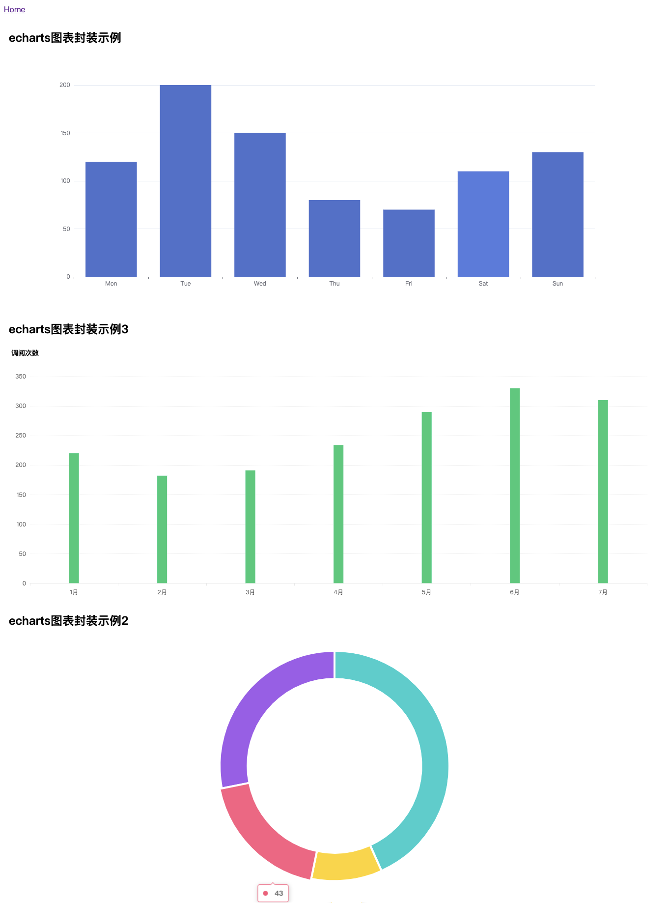
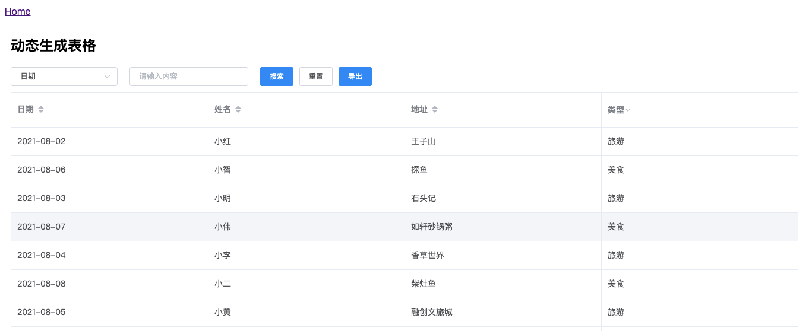
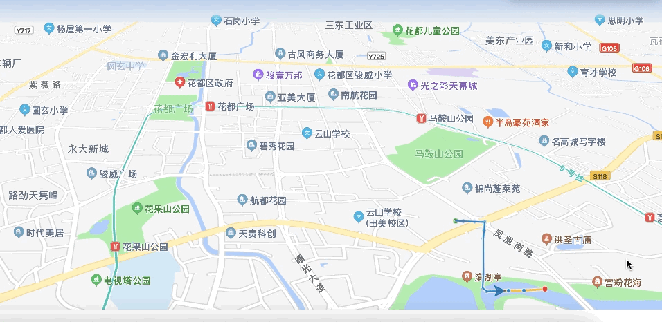
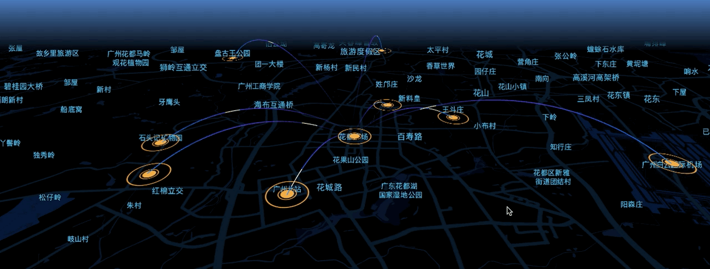
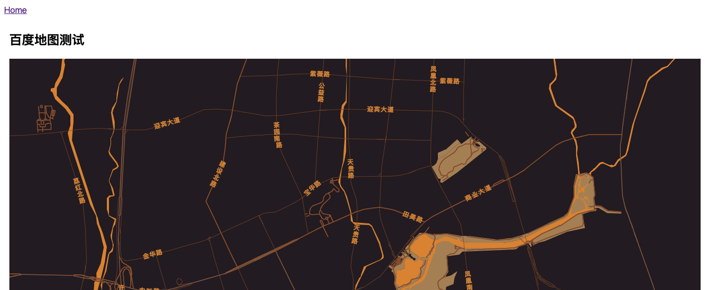
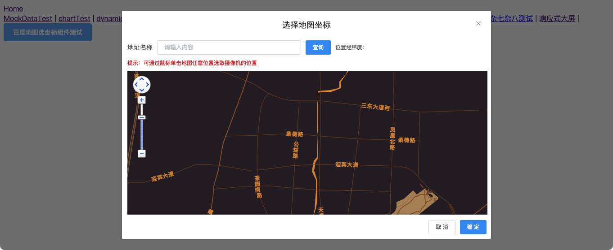

# vue-skill

## Project setup
```
npm install
```

### Compiles and hot-reloads for development
```
npm run serve
```

### Compiles and minifies for production
```
npm run build
```

### Lints and fixes files
```
npm run lint
```

### Customize configuration
See [Configuration Reference](https://cli.vuejs.org/config/).

## 环境

平时是在`node`版本`v12.22.4`环境下运行`vue ui`开发的，`npm`版本是`6.14.14`，用的`nvm`管理版本切换，在别的版本应该也可以开发，自行尝试了。

## 例子

### 1、MockDataTest

[vue本地模拟服务器请求mock数据](https://juejin.cn/post/6995147964427534373)


### 2、chartTest

[vue项目中封装echarts的比较优雅的方式](https://juejin.cn/post/6995518429952212999)



### 3、dynamicTableTest

[Vue + Element，记动态生成表格在一个运维项目中的应用](https://juejin.cn/post/6996102642061557773)



### 4、polylineTest

[Vue对高德地图2.0的封装使用](https://juejin.cn/post/6998363016571912222)



### 5、amapLocaTest

[高德开放平台GeoHUB初用（Vue使用高德地图Loca 2.0）](https://juejin.cn/post/7002975848152170504)



### 6、video-time-slider，用于IVR视频回播的时间选择插件

[video-time-slider，用于IVR视频回播的时间选择插件](https://juejin.cn/post/7051500204209471501)


### 7、如何快速开发一个响应式移动端页面

[如何快速开发一个响应式移动端页面](https://juejin.cn/post/7052157317504040968)


### 8、echart地图显示测试

[vue2项目中封装echarts地图比较优雅的方式](https://juejin.cn/post/7072658645296611359)


### 9、vue2项目中给echarts地图设置背景图和打点

[vue2项目中给echarts地图设置背景图和打点](https://juejin.cn/post/7097136735963840542)


### 10、响应式大屏

[Echarts大屏展示，实现响应式比较常用的方式](https://juejin.cn/post/7099746692295032846)


### 11、bmapTest

[Vue2项目中对百度地图的封装使用](https://juejin.cn/post/7109381065344548901)



### 12、百度地图选坐标组件测试

[vue2项目封装百度地图3.0拾取坐标控件](https://juejin.cn/post/7109693496453234719)

